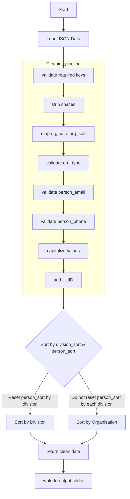
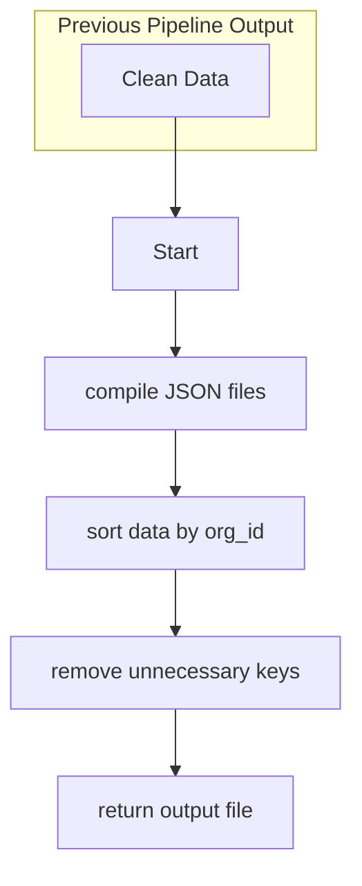

### 1st: cleaning script
- cleaning data
- sort by division_sort & person_sort
- return clean json files

### 2nd: compiling script
- compile the cleaned data
- sort by org_id, division_sort, person_sort
- remove key (person_sort_order)
- return compiled data

