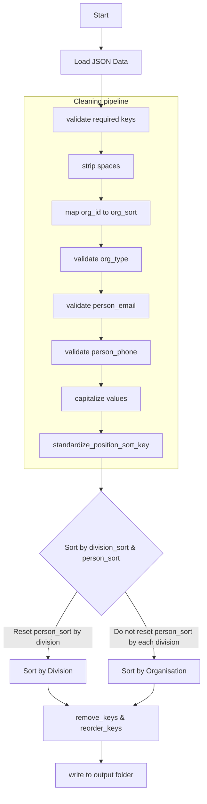
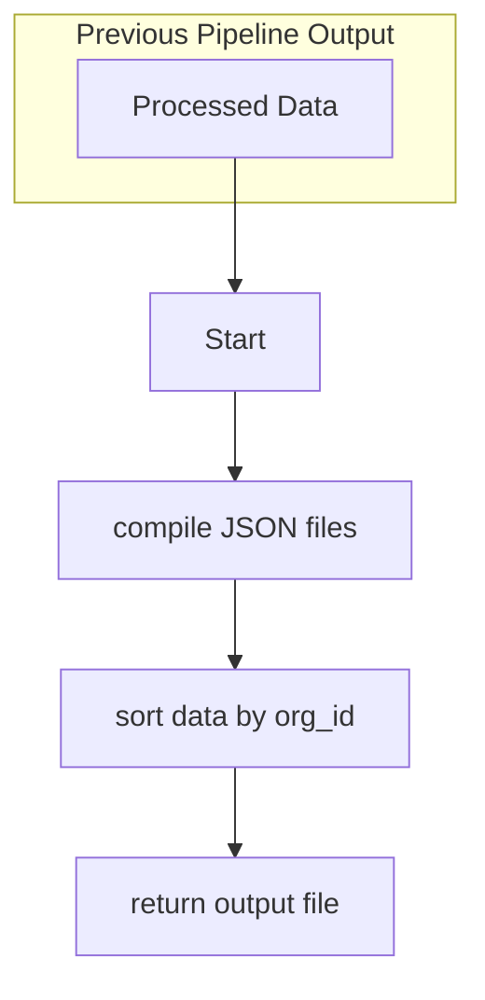

### 1st: process_data.py
- cleaning and processing data
- sort by division_sort & person_sort
- return clean json files


### 2nd: compiling script
- compile the cleaned data
- sort by org_id, division_sort, person_sort
- return compiled data


### Draft: run_spiders.py

    Run Scrapy spiders based on a structured hierarchy in spiders/ folder.

    Usage:
    ------
    ```python run_spiders.py <spider name | category | special keyword> [organization name] [subcategory]```
    
    *Note*: No extra arguments (`organization name` or `subcategory`) can be used with a <spider name> and <special keywords>.

    Arguments:
    ----------
    1. <spider name | category | special keyword> (REQUIRED):
    - Spider Name: Specify a specific spider by its name (e.g., 'jpm', 'mof', 'mohr').
    - Category:
        • 'ministry'      : Runs all spiders under the 'ministry' directory.
        • 'ministry_orgs' : Runs all spiders under the 'ministry_orgs' directory.
        • 'non_ministry'  : Runs all spiders under the 'non_ministry' directory.
        • 'bahagian_unit' : Runs all spiders under the 'bahagian_unit' directory.
    - Special Keywords: 
        • 'all'           : Runs every available spider.
        • 'list'          : Runs a predefined list of spiders in the code. 

    2. [organization name] (OPTIONAL): Specify an organization within the category if applicable (e.g., 'jpm', 'mohr').

    3. [subcategory] (OPTIONAL): Provide a specific subcategory under the organization (e.g., 'jabatan', 'agensi').

    *Note*: OPTIONAL arguments only applies for <Category>
    
    Examples:
    ---------
    To run a specific spider by its spider name:
    python run_spiders.py jpm

    To run all `ministry` category spiders:
    python run_spiders.py ministry
    
    To run all spiders under the `ministry_orgs` category for the `jpm` organization:
    python run_spiders.py ministry_orgs jpm

    To run only the spiders under the `ministry_orgs` category for the `jpm` organization within the `jabatan` subcategory:
    python run_spiders.py ministry_orgs jpm jabatan

    To run a predefined list of spiders:
    python run_spiders.py list